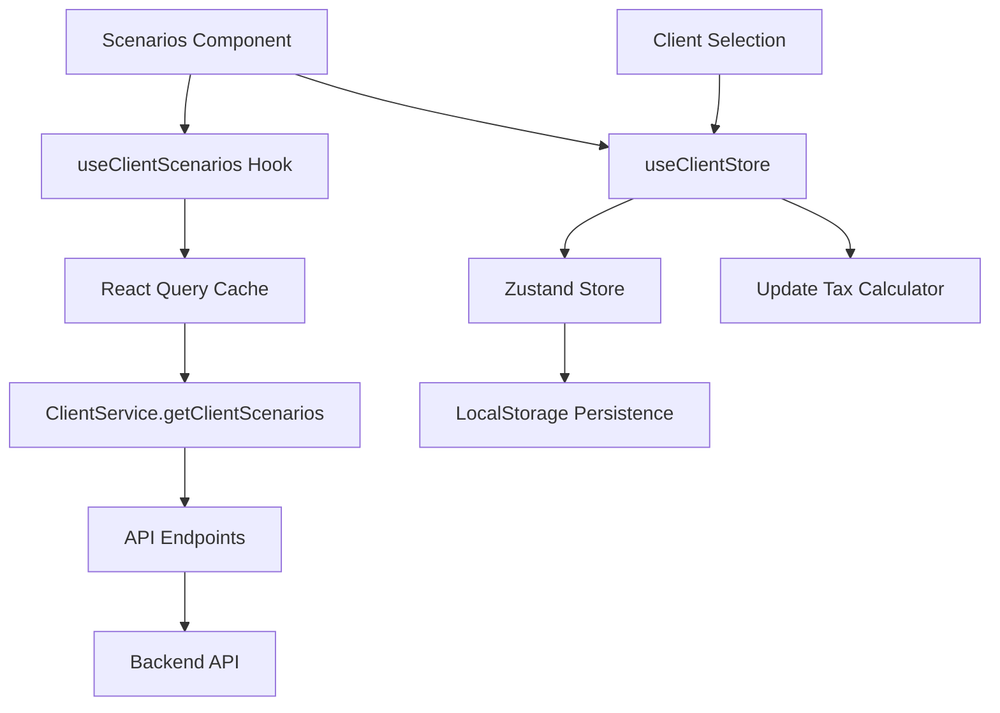

# Domain-Driven Design Architecture

## Overview

The web application has been converted to a **Domain-Driven Design (DDD)** architecture with **Zustand** for state management and **TanStack React Query** for data fetching. The application now features a comprehensive client scenarios system that loads all clients with their income and business data.

## Architecture Structure

```
src/
├── domains/                    # Domain-specific logic
│   └── client/                # Client domain
│       ├── types/             # TypeScript interfaces
│       ├── services/          # API services
│       ├── hooks/             # React Query hooks
│       ├── store/             # Zustand store
│       └── index.ts           # Domain exports
├── shared/                    # Shared utilities
│   ├── providers/             # React providers
│   ├── utils/                 # Utility functions
│   ├── config/                # Configuration
│   └── index.ts               # Shared exports
└── components/                # UI components
    ├── scenarios.tsx          # Main scenarios component
    ├── tax-calculator.tsx     # Tax calculator
    └── ui/                    # Reusable UI components
```

## Key Features

### 🏗️ Domain-Driven Design

- **Client Domain**: Complete separation of client-related logic
- **Type Safety**: Comprehensive TypeScript interfaces
- **Service Layer**: Clean API abstraction
- **Business Logic**: Domain-specific operations

### 🔄 State Management (Zustand)

- **Global Client State**: Selected client and scenarios
- **Persistence**: State persisted to localStorage
- **DevTools**: Redux DevTools integration
- **Type Safety**: Fully typed store

### 📡 Data Fetching (TanStack React Query)

- **Caching**: Intelligent query caching (5-minute stale time)
- **Background Updates**: Automatic data refresh
- **Error Handling**: Comprehensive error management
- **Loading States**: Built-in loading and error states
- **Optimistic Updates**: Query invalidation on mutations

### 🎯 Scenarios Component

- **Client Loading**: Loads all clients with income and business data
- **Search & Filter**: Real-time search and sorting
- **Statistics**: Overview of total income, business revenue, etc.
- **Client Selection**: Click to select client (stored in Zustand)
- **Responsive Design**: Mobile-friendly grid layout

## Domain Structure

### Client Domain (`src/domains/client/`)

#### Types (`types/client.types.ts`)
```typescript
interface Client {
  id: string;
  firstName: string;
  lastName: string;
  email: string | null;
  phone: string | null;
  // ... other properties
}

interface ClientScenario {
  client: Client;
  totalIncome: number;
  totalBusinessRevenue: number;
  businessCount: number;
  incomeCount: number;
  currentYear: number;
}
```

#### Services (`services/client.service.ts`)
- **ClientService**: Static class with API methods
- **Error Handling**: Comprehensive error management
- **Type Safety**: Fully typed API responses
- **Flexible Response Handling**: Handles different API response structures

#### Hooks (`hooks/useClient.hooks.ts`)
- **useClientScenarios()**: Main hook for scenarios data
- **useClients()**: Paginated client list
- **useClient()**: Individual client data
- **Mutations**: Create, update, delete operations
- **Query Keys**: Organized query key factory

#### Store (`store/client.store.ts`)
- **Zustand Store**: Global state management
- **Actions**: Client selection, scenarios management
- **Persistence**: LocalStorage integration
- **Selectors**: Convenient state selectors

## State Management Flow



## API Integration

### Endpoints Used
- `GET /clients` - List all clients
- `GET /client-income/client/:id` - Client income data
- `GET /client-businesses/client/:id` - Client business data

### Response Handling
- Flexible response structure handling
- Error recovery and retry logic
- Loading state management
- Data validation and filtering

## Error Handling Strategy

### 1. Service Layer
- HTTP error handling with detailed messages
- Network error recovery
- Response validation

### 2. Component Layer
- Loading states with spinners
- Error boundaries with retry buttons
- Graceful degradation for missing data

### 3. Query Layer
- Automatic retries with exponential backoff
- Stale-while-revalidate strategy
- Background refresh on window focus

## Performance Optimizations

### 1. React Query Caching
- **Stale Time**: 5 minutes for scenarios, 2 minutes for real-time data
- **Cache Time**: 10 minutes garbage collection
- **Background Updates**: Automatic refresh strategies

### 2. Component Optimization
- **useMemo**: Expensive filtering and sorting operations
- **React.memo**: Component memoization where appropriate
- **Lazy Loading**: Code splitting for large components

### 3. Data Fetching
- **Parallel Requests**: Simultaneous income and business data fetching
- **Request Deduplication**: Automatic by React Query
- **Optimistic Updates**: Immediate UI updates with rollback

## Environment Configuration

### Required Environment Variables
```bash
# .env.local
NEXT_PUBLIC_API_URL=http://localhost:8000
```

### Development Setup
1. **Install dependencies**:
   ```bash
   npm install zustand @tanstack/react-query @tanstack/react-query-devtools
   ```

2. **Start development server**:
   ```bash
   npm run dev
   ```

3. **Ensure backend API is running**:
   - API should be available at `http://localhost:8000`
   - Endpoints should return proper JSON responses

## Usage Examples

### Using the Client Store
```typescript
import { useClientStore, useSelectedClient } from '@/domains/client';

function MyComponent() {
  const { setSelectedClient, clearSelectedClient } = useClientStore();
  const selectedClient = useSelectedClient();
  
  // Use selected client data
  if (selectedClient) {
    console.log('Selected:', selectedClient.client.firstName);
  }
}
```

### Fetching Client Data
```typescript
import { useClientScenarios } from '@/domains/client';

function ScenariosView() {
  const { data: scenarios, isLoading, error } = useClientScenarios();
  
  if (isLoading) return <LoadingSpinner />;
  if (error) return <ErrorMessage error={error} />;
  
  return <ScenariosList scenarios={scenarios} />;
}
```

## Debugging

### React Query DevTools
- Available in development mode
- Access via floating icon in bottom-right corner
- Shows query status, cache contents, and network activity

### Console Logging
- Service layer logs API responses and errors
- Component layer logs invalid data structures
- Store actions logged in Redux DevTools

### Zustand DevTools
- Integrated with Redux DevTools browser extension
- Shows state changes and time-travel debugging
- Action names for easy tracking

## Future Enhancements

### 1. Additional Domains
- **Tax Domain**: Tax calculations and rules
- **Document Domain**: File uploads and processing
- **Report Domain**: Generated reports and analytics

### 2. Advanced Features
- **Real-time Updates**: WebSocket integration
- **Offline Support**: Service worker caching
- **Advanced Filtering**: Complex query builders
- **Bulk Operations**: Multi-client actions

### 3. Performance
- **Virtual Scrolling**: For large client lists
- **Incremental Loading**: Pagination with infinite scroll
- **Background Sync**: Offline-first architecture

## Testing Strategy

### Unit Tests
- Domain services with mocked API calls
- Utility functions with edge cases
- Store actions and state changes

### Integration Tests
- React Query hooks with mock server
- Component interactions with state
- API integration scenarios

### E2E Tests
- Full user workflows
- Error handling scenarios
- Performance benchmarks

## Deployment Considerations

### Environment Variables
```bash
# Production
NEXT_PUBLIC_API_URL=https://api.your-domain.com

# Staging  
NEXT_PUBLIC_API_URL=https://staging-api.your-domain.com
```

### Build Optimization
- Tree-shaking unused code
- Bundle analysis for size optimization
- CDN deployment for static assets

This architecture provides a scalable, maintainable foundation for the tax management application with clear separation of concerns and robust data management. 